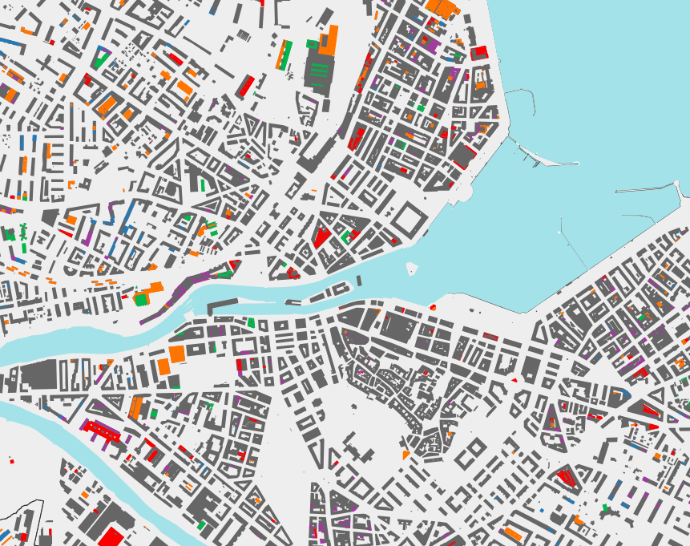
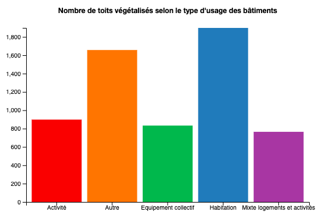
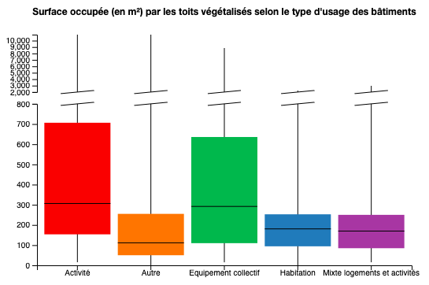
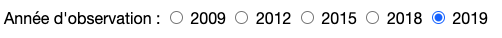
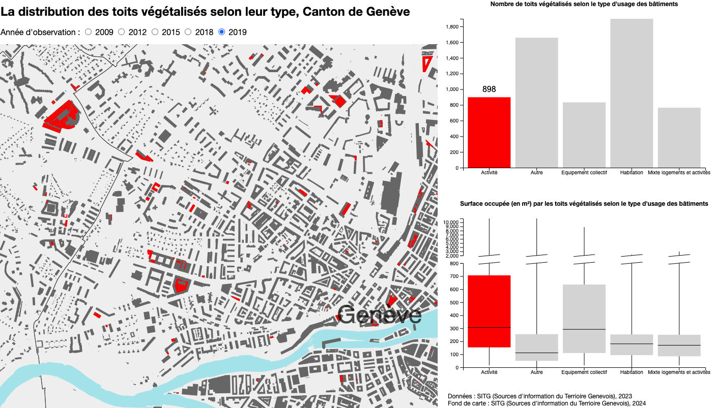

# Toits végétalisés à Genève

## Brève Description du Travail
Notre visualisation de données concerne les toits végétalisés sur le canton de Genève. Cette visualisation se décline sous plusieurs formes : une carte, un graphique en barres et un box plot. 

- **Carte** : Identifie visuellement les toits végétalisés sur le canton et leur répartition sur l’ensemble du territoire et au sein des communes genevoises. Les toits végétalisés sont divisés en différentes couleurs selon l’utilisation des bâtiments qu’ils recouvrent : « Activités », « Autres », « Équipements collectifs », « Habitation », « Mixte logements et activités ».

    
  
- **Graphique en Barres** : Montre le nombre de toits végétalisés pour chaque utilisation des bâtiments.

    
  
- **Box Plot** : Permet d’identifier, pour chaque type d’utilisation des bâtiments, la surface en mètres carrés recouverte par les toits végétalisés. Les boîtes à moustache représentent les 50% (entre 25% et 75%) des valeurs des surfaces pour chaque type d’utilisation des bâtiments.

    

### Interactions entre les Visualisations
Nos trois visualisations sont connectées les unes avec les autres de plusieurs façons :

1. **Boutons Radio pour Sélectionner l'Année** : L’utilisateur peut choisir l’année à analyser (2009, 2012, 2015, 2019). Les visualisations s’adaptent simultanément à l’année sélectionnée.

    
   
2. **Survol de la Souris** : En passant la souris sur une visualisation :
   - Si un toit végétalisé est touché sur la carte, seul le type d’utilisation des bâtiments correspondant apparaît sur la carte, tandis que les graphiques en barres et le box plot réagissent en affichant uniquement le type d’utilisation du bâtiment en question.
   - Si la souris touche une barre ou une boîte à moustache, la carte réagit en gardant uniquement la couleur touchée dans les graphiques.

   

### Utilisation
Nos visualisations et leurs fonctions interactives permettent d’avoir une vue globale de l’évolution des toits végétalisés sur le canton de Genève et de la surface qu’ils représentent. Cette application peut être utile pour des urbanistes, architectes ou toute personne curieuse de connaître quels types de bâtiments les toits végétalisés recouvrent et leur évolution sur 10 ans.

## Données
Les données concernant les toits végétalisés et leur localisation proviennent du catalogue des données des SITG « Le territoire genevois à la carte » : [Lien vers les données](https://ge.ch/sitg/sitg_catalog/sitg_donnees?keyword=&geodataid=7176&topic=tous&service=tous&datatype=tous&distribution=tous&sort=auto). La base de données « Toitures végétalisées » comprend différentes variables utilisées pour notre visualisation :

- **Coordinates** : Coordonnées géographiques utilisées pour construire la carte.
- **NOMEN_CLASS** : Types d’utilisation des bâtiments.
- **ANNEE** : Dates d’observation des toits végétalisés (utilisées pour la fonctionnalité dynamique des boutons radios).
- **SHAPE.AREA** : Surface de chaque toit (utilisée pour construire le box plot).

Les années disponibles sont : 2009, 2012, 2015, 2018, 2019. Les types d’utilisation des bâtiments sont : Activité, Autre, Équipements collectifs, Habitation, Mixte logements et activités.

### Fond de Carte
Nous avons utilisé trois bases de données du catalogue des SITG :
- **Commune Genevoise** : Nom des communes sous « NAME » et coordonnées pour afficher les frontières des communes.
- **Emprise du Lac Léman** : Pour montrer le lac, le Rhône et l’Arve.
- **Bâtiments Hors-Sol** : Pour montrer les bâtiments.

## Utilisation
### Windows
1. Téléchargez le fichier ZIP et décompressez-le dans un dossier de votre choix.
2. Ouvrez l'invite de commandes et naviguez jusqu'au dossier extrait : `cd C:\Users\VotreNomUtilisateur\DossierDeVotreChoix\NomDuDossier`
3. Démarrez un serveur local avec Python : `python -m http.server`
4. Ouvrez votre navigateur web et allez à l'adresse : `http://0.0.0.0:8000/`

### MacOS
1. Téléchargez le fichier ZIP et extrayez-le dans un dossier de votre choix.
2. Ouvrez le Terminal et naviguez jusqu'au dossier extrait : `cd /Users/VotreNomUtilisateur/DossierDeVotreChoix/NomDuDossier`
3. Lancez un serveur local avec Python : `python3 -m http.server`
4. Ouvrez votre navigateur web et allez à l'adresse : `http://0.0.0.0:8000/`

Il peut aussi être visualisé [ici](https://tanguy-linard.github.io/toits-vegetalises-geneve)

## Contexte de développement
Ce projet a été développé lors du semestre de printemps 2024 dans le cadre du cours de Visualisation de données dispensé par Isaac Pante (SLI, Lettres, UNIL)

## Auteurs
Ce projet a été réalisé par Tanguy Linard et Joseph Grob.
